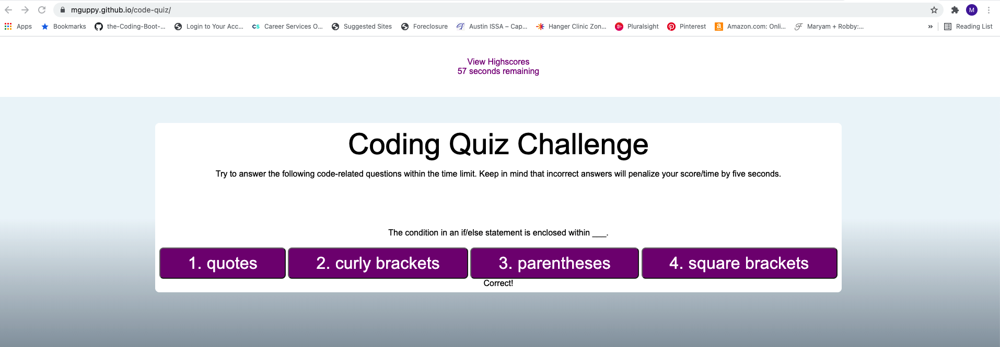

# code-quiz
For this project, the following acceptance criteria was followed - 
GIVEN I am taking a code quiz
WHEN I click the start button
THEN a timer starts and I am presented with a question
WHEN I answer a question
THEN I am presented with another question
WHEN I answer a question incorrectly
THEN time is subtracted from the clock
WHEN all questions are answered or the timer reaches 0
THEN the game is over
WHEN the game is over
THEN I can save my initials and my score

I built a coding quiz that includes 4 coding knowledge questions.  When the user clicks "Start", they are presented with the first question.  If the user gets the question wrong, 5 seconds is deducted from their time.  If the user gets the question correct, a point is given to the user.  Before the user can move to the next question, the correct answer has to be chosen.  Once the user has answered all questions correctly, the user is then prompted for their initials.  Their initials as well as their score is then stored to local storage.  At any time, the user can click "View Highscores" and see the scores of all users that have been saved to local storage.

https://mguppy.github.io/code-quiz/

Credits: w3schools.com, my tutor, classmates and my programmer husband